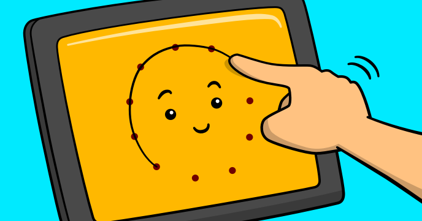

Connect the dots are popular in all activity books. There is an impulse to connect all those number to see what drawing is hiding behind.

In this tutorial, we’ll build a “connect the dots” type program using JavaScript.

Suggested use: You can extend the program to display a secret message or greeting once all the dots are connected. Then share your program with your family or friend!
 
## Source code 
The JavaScript source code of this program can be found [here](sketches/program.js). To run it, you need to import it in the [codeguppy.com](https://codeguppy.com) online editor. Alternatively, you can use the source code in your p5.js sketches (advanced use). 
## Online version 
To see the code running, check the online playground at [https://codeguppy.com/code.html?t=connect_dots](https://codeguppy.com/code.html?t=connect_dots) 
## Next steps 
Please check [codeguppy.com](https://codeguppy.com) for many other fun JavaScript programs and games for beginners. To stay up to date with CodeGuppy development please follow [@codeguppy](https://twitter.com/codeguppy) on Twitter.  
